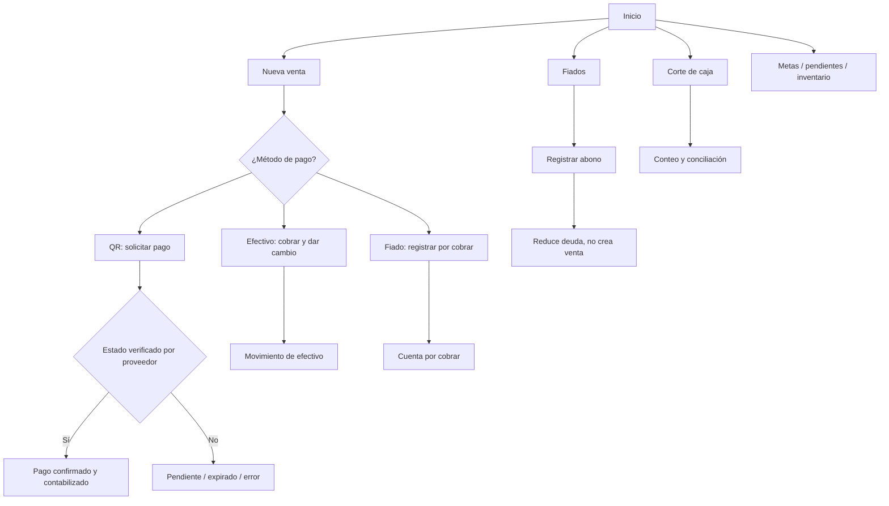

# Mapa de experiencia (propuesta, revisar contra repo)

```mermaid
flowchart TD
    A[Inicio] --> B[Nueva venta]
    B --> C{¿Método de pago?}
    C --> D[Efectivo: cobrar y dar cambio]
    C --> E[QR: solicitar pago]
    C --> F[Fiado: registrar por cobrar]
    E --> G{Estado verificado por proveedor}
    G -->|Sí| H[Pago confirmado y contabilizado]
    G -->|No| I[Pendiente / expirado / error]
    D --> J[Movimiento de efectivo]
    F --> K[Cuenta por cobrar]
    A --> L[Fiados]
    L --> M[Registrar abono]
    M --> N[Reduce deuda, no crea venta]
    A --> O[Corte de caja]
    O --> P[Conteo y conciliación]
    A --> Q[Metas / pendientes / inventario]
```

**Nota:** diagrama conceptual, **NO se debe traducir literalmente a eventos bancarios** sin inspeccionar adaptadores actuales.
